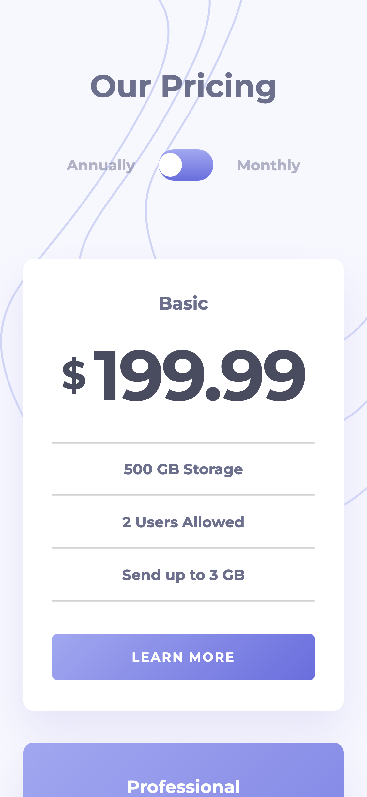
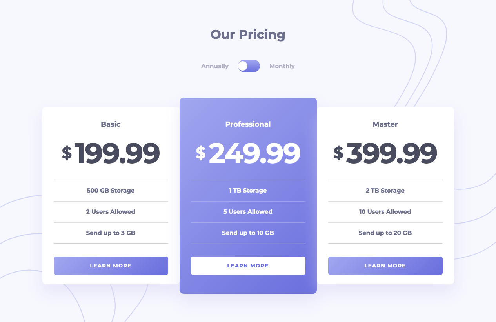

# Frontend Mentor - Pricing component with toggle solution

## Component Architecture

[Github](https://github.com/hirohiro2255/pricing-component-with-toggle/blob/main/COMPONENT_ARCHITECTURE.md)

## Table of contents

- [Overview](#overview)
  - [The challenge](#the-challenge)
  - [Screenshot](#screenshot)
  - [Links](#links)
- [My process](#my-process)
  - [Built with](#built-with)
  - [What I learned](#what-i-learned)
  - [Continued development](#continued-development)
  - [Useful resources](#useful-resources)
- [Author](#author)
- [Acknowledgments](#acknowledgments)

## Overview

### The challenge

Users should be able to:

- View the optimal layout for the component depending on their device's screen size
- Control the toggle with both their mouse/trackpad and their keyboard
- **Bonus**: Complete the challenge with just HTML and CSS

### Screenshot

### Links

- Solution URL: [Github](https://github.com/hirohiro2255/pricing-component-with-toggle)
- Live Site URL: [Vercel](https://pricing-component-with-toggle-flax.vercel.app/)

## My process

### Built with

- Semantic HTML5 markup
- Flexbox
- CSS Grid
- Mobile-first workflow
- [Svelte](https://svelte.dev/) - JS library

### Useful resources

- [svelte](https://www.example.com) - JS Library I used for this app.

## Author

- Frontend Mentor - [@hirohiro2255](https://www.frontendmentor.io/profile/hirohiro2255)
